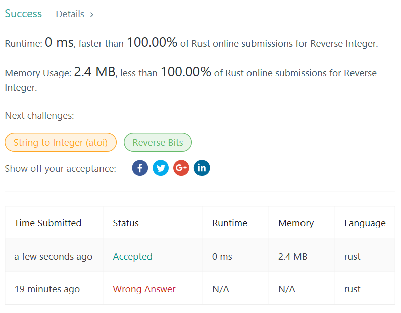

# 7. Reverse Integer

## Description

Given a 32-bit signed integer, reverse digits of an integer.

## Example

```text
Input: 123
Output: 321

Input: -123
Output: -321

Input: 120
Output: 21
```

## Note

Assume we are dealing with an environment which could only store integers within the 32-bit signed integer range: [−231,  231 − 1]. For the purpose of this problem, assume that your function returns 0 when the reversed integer overflows.

## Solution

```rust
impl Solution {
    pub fn reverse(x: i32) -> i32 {
        let mut c_value = x;
        let mut sum = 0;
        let mut digit = c_value % 10;
        c_value /= 10;
        while c_value != 0 {
            sum *= 10;
            sum += digit;
            digit = c_value % 10;
            c_value /= 10;
            println!("{} {} \t\t sum {}", c_value, digit, sum);
        }
        if sum >  214748364 || sum ==  214748364 && digit >  7 
        || sum < -214748364 || sum == -214748364 && digit < -8 {
            0
        } else {
            sum * 10 + digit
        }
    }
}
```

## Thoughts

- use `i32::max_value()` to see the min `i32`
- don't use rust as c/c++, they are different.

## Performance

